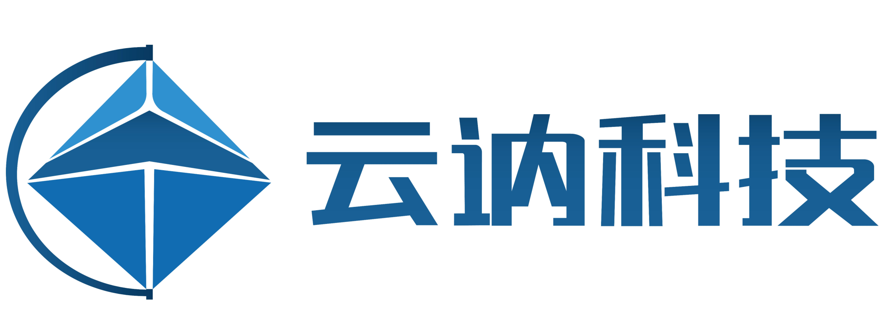

.. Pursuit developer guide documentation master file, created by
   sphinx-quickstart on Thu Aug  8 18:39:35 2024.
   You can adapt this file completely to your liking, but it should at least
   contain the root `toctree` directive.

Welcome to the Developer Guide of Pursuit Autopilot
======================================================

.. image:: img/pursuit_view.png
   :height: 270 px
   :width: 750 px
   :scale: 100 %
   :align: center

Motivation
--------------

Autonomous driving has been widely accepted as an essential tool in various industrial applications including surveillance, infrastructure inspection, agriculture, etc.
Despite that technologies are evolving rapidly in this field, the scaling of autonomous driving applications is hindered by the scarcity of open collaborative products that
can be easily integrated for vertical market segments. The Pursuit autopilot is presented by Cloudkernel Technologies as an open solution for agriculture and surveillance,
and it aims to aid partners to deliver autonomous driving services with maximized efficiency to end-users.

About Us
-----------

Cloudkernel Technologies (Shenzhen) is a technology-driven company geared towards science and technology education in robotics. We offer the following products and services:

* Education products and courses, including unmanned aerial vehicles (UAV), unmanned ground vehicles (UGV), unmanned flying rovers (UFR) and AI education.

* Industry solutions such as UAV autopilot, self-driving software suite.

Other products can be found in the following links:

* Kerloud autopilot: `<https://cloudkernel.cn/kerloud-autopilot>`_
* Kerloud UAV: `<https://cloudkernel.cn/kerloud-uav>`_
* Kerloud flying rover series: `<https://kerloud-flyingrover.readthedocs.io>`_
* Kerloud VTOL products:`<https://kerloud-vtol.readthedocs.io>`_
* Kerloud autocar series: `<https://kerloud-autocar.readthedocs.io>`_
* Kerloud DASA (Dynamic Autonomous System Arena) solution: `<https://kerloud-dasa.readthedocs.io>`_

Our main webpage is `<https://cloudkernel.cn>`_, and you may contact us by email: contact@cloudkernel.cn.

欢迎访问Pursuit开发指南
===============================

目标
-----------

自动驾驶已被广泛接受为各种工业应用（包括监控、基础设施检查、农业等）的必备工具。尽管该领域的技术正在迅速发展，但自动驾驶应用规模化仍受到缺乏易于集成到垂直细分市场的开放式协作产品的阻碍。
Pursuit自动驾驶仪由云讷科技（深圳）有限公司推出，是一种用于农业和监控的开放式解决方案，旨在帮助合作伙伴以最大效率向最终用户提供自动驾驶服务。

关于我们
----------------

云讷科技（深圳）有限公司是一家机器人科技教育公司，我们提供下述产品和服务：

* 提供基于无人系统技术的教育产品和课程：包括无人机，无人车，无人飞车和人工智能教育

* 提供部分行业核心解决方案，如无人机飞行控制器，无人驾驶软件方案等

其他产品可以在下述链接找到：

* Kerloud 自动驾驶仪: `<https://cloudkernel.cn/kerloud-autopilot>`_
* Kerloud 无人机: `<https://cloudkernel.cn/kerloud-uav>`_
* Kerloud 无人飞车系列: `<https://kerloud-flyingrover.readthedocs.io>`_
* Kerloud 垂直起降固定翼产品: `<https://kerloud-vtol.readthedocs.io>`_
* Kerloud 无人车系列: `<https://kerloud-autocar.readthedocs.io>`_
* Kerloud DASA (Dynamic Autonomous System Arena) 机器人赛场方案: `<https://kerloud-dasa.readthedocs.io>`_

我们的主页是 `<https://cloudkernel.cn>`_, 你可以通过邮件 contact@cloudkernel.cn 联系到我们。

.. toctree::
   :caption: Pursuit Developer Guide
   :hidden:
   :maxdepth: 2

   intro
   gallery

.. toctree::
   :caption: Pursuit 开发指南
   :hidden:
   :maxdepth: 2

   intro_zh
   gallery_zh
