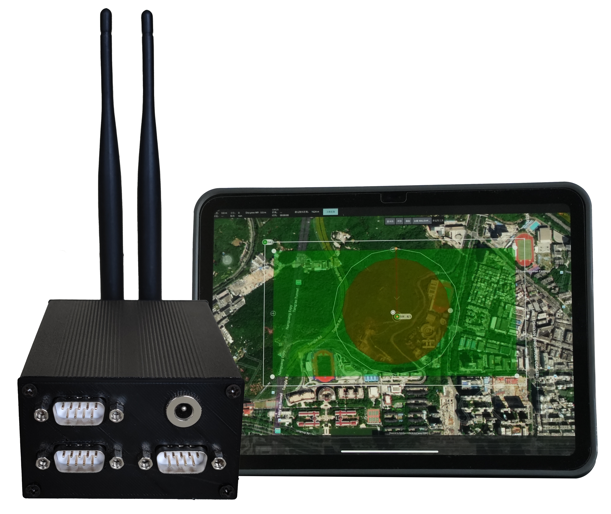

介绍
=====================

Pursuit自驾仪由云讷科技出品，为行业应用提供自动驾驶的核心工具，可以帮助终端用户快速构建基于RTK定位的自动驾驶方案。

.. role:: underline-text
   :class: underline-text

:underline-text:`这里的在线文档只适用于有较强ROS和C++基础的开发者，操作用户请直接参考本产品交付时附带的用户手册`。

使用场景
------------

Pursuit自动驾驶仪是一款为开阔环境设计的高精度定位、导航与控制系统，它专为农业自动化和巡检自动化等领域提供定制化解决方案，以增强作业的精确性和效率。

* **农业自动化领域的应用**：

Pursuit自动驾驶仪可以应用于智能农业机械，为播种、喷洒和收割等农业作业提供了高效、精准的自主导航解决方案，极大地提升作业的自动化水平和生产效率。

* **巡检自动化领域的应用**：

在巡检领域，Pursuit自动驾驶可以装备于智能巡检车辆，通过智能路径规划和实时数据反馈，提高巡检效率，简化操作流程，降低人为干预的需求。

方案特点
------------

* **通用性强**： Pursuit自动驾驶仪可适配市面上通用线控底盘，支持阿克曼、四轮差速、四转四驱、履带等主流车型，为用户提供更多选择空间。

* **精度高**： 通过4G RTK技术（无需基站），Pursuit自动驾驶仪实现了2cm的定位精度，同时在水泥路况下巡线精度可达±0.1m，确保车辆的精准可靠性。

* **自动避障**： 配备激光雷达，Pursuit自动驾驶仪在全局路径运动的过程中，可实时感知障碍物，通过局部路径规划完成自动避障，确保安全行驶。

* **交互简单**： Pursuit自动驾驶仪采用直观的触屏用户界面，用户只需轻触屏幕，在地图上选择航路点或目标区域，即可轻松启动任务，用户体验简单而高效。

