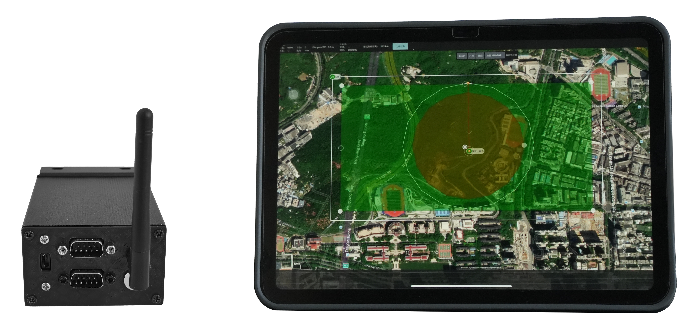
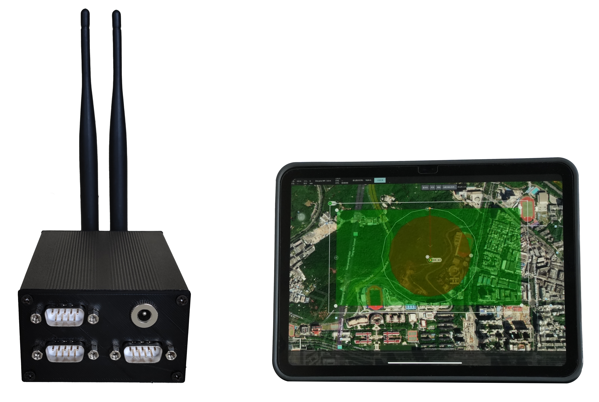
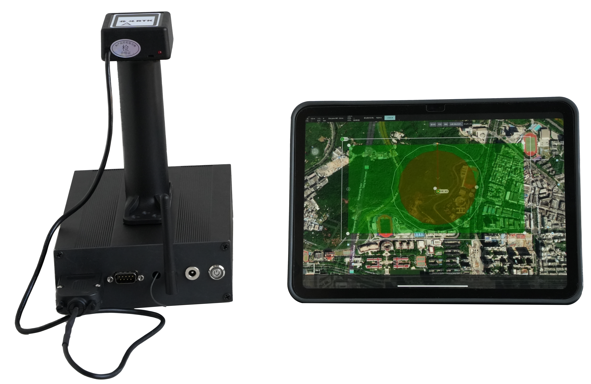

# 产品选项

| 款型         | 含机载电脑 | RTK定位 | 自动巡线 | 自动避障 | 地面站APP |
| ------------ | ---------- | ------- | -------- | -------- | --------- |
| Model A      | ×          | √       | √        | ×        | √         |
| Model A+     | ×          | √       | √        | √        | √         |
| Model B      | √          | √       | √        | √        | √         |

---

## Model A款型

### 规格参数

- **尺寸**: 76mmx46mmx100mm
- **重量**: 0.3kg（不含线束）
- **功能**: RTK 高精度定位、高精度导航、地面站APP
- **接口**: CAN、RTK、DEBUG、DC12V电源、无线数传

### 适用场景

支持航路点、点位和高精度巡线控制，适用于需要高精度RTK定位与导航的空旷场景，如农业和草原等领域。

---

## Model A+ 款型

### 规格参数

- **尺寸**: 76mmx46mmx100mm
- **重量**: 0.35kg（不含线束）
- **功能**: RTK 高精度定位、高精度导航、地面站APP、自动避障
- **接口**: CAN、RTK、ROS通信、DEBUG、12V电源、无线数传

### 适用场景

用户底盘已搭载工控机，适用于需要高精度RTK定位和自动避障导航的复杂场景，如巡检、机场和矿山等领域。

---

## Model B款型

### 规格参数

- **尺寸**: 200mmx145mmx54mm
- **重量**: 0.87kg（不含线束）
- **功能**: RTK 高精度定位、高精度导航、地面站APP、自动避障
- **接口**: CAN、RTK、ROS通信、DEBUG、12V电源、无线数传

### 适用场景

为用户提供全套自动驾驶仪套件，包含机载电脑机，适用于对高精度RTK定位和自动避障导航有需求的复杂场景，如巡检、机场和矿山等领域。