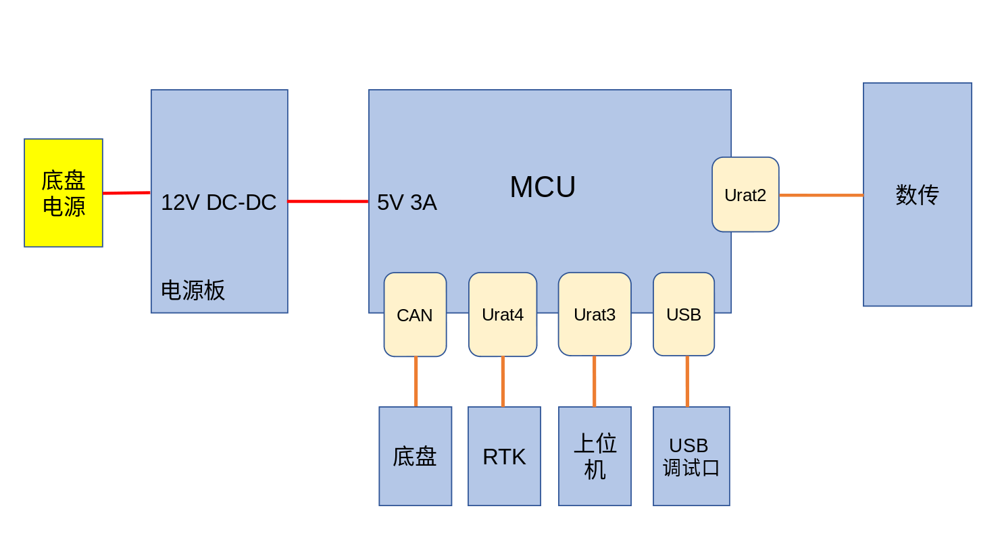
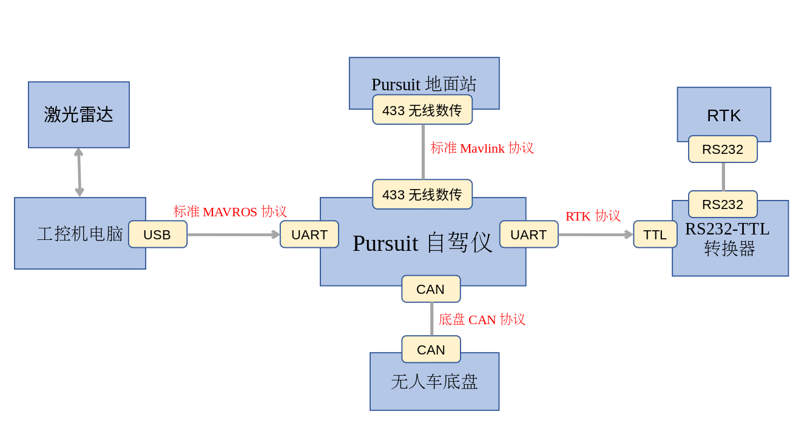

系统总览
====================

.. image:: img/Model_A_Plus_Port.png
   :height: 400 px
   :width: 400 px
   :scale: 90%
   :align: center

Pursuit自动驾驶仪是一款集成度高、功能全面的导航套件，主要由以下几个核心组件构成：

- 自驾仪主体：作为系统的核心，集成了处理单元和传感器，负责执行自动驾驶任务。
- 数传天线：用于无线数据传输，确保自动驾驶仪和地面站之间的通信。
- 外部接口：提供了一系列接口选项，以便于与各种外部设备连接和协同工作。系统预留了以下接口：
- RTK接口：自动驾驶仪集成了高精度RTK定位技术，用于RTK设备的连接
- CAN接口：用于Pursuit自动驾驶仪与无人车VCU进行CAN通信，以控制无人车的位置、速度、角度等
- DC12V电源接口：连接外部DC 12V电源，给自驾仪供电
- ROS通信接口：该接口主要用于与上位机ROS（机器人操作系统）进行串口通信
- DEBUG调试接口：用于开发和调试阶段，在地面站软件中执行软件调试、固件更新和参数配置等操作

电气概述
------------

通信拓扑
-----------

