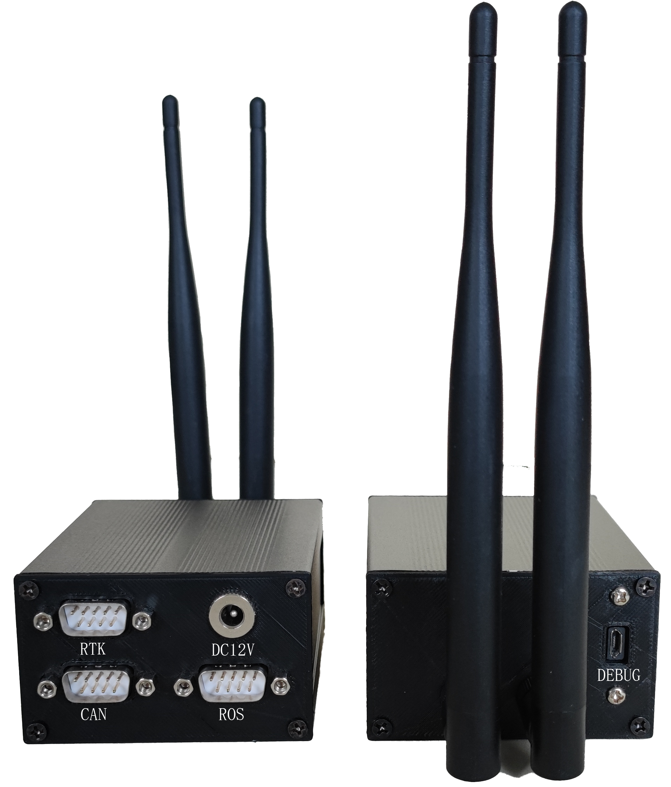
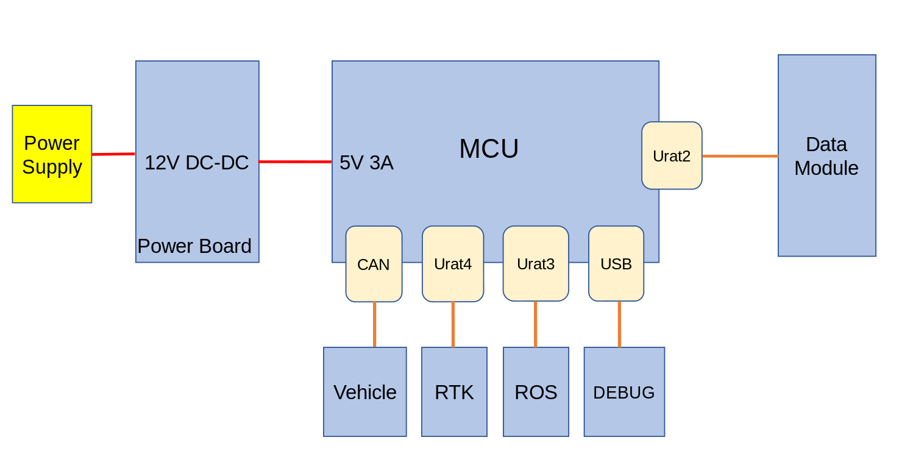
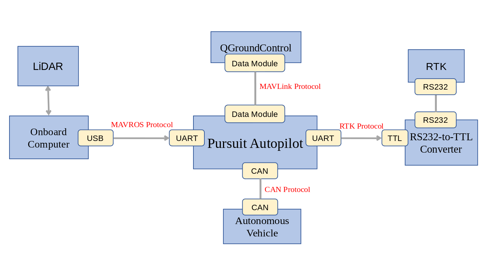

System Overview
=======================

Pursuit autopilot is a highly integrated and fully functional navigation kit, mainly composed of the following core components:

- Autopilot body: as the core of the system, it integrates processing units and sensors and is responsible for performing autopilot tasks.

- Data transmission antenna: used for wireless data transmission to ensure communication between the autopilot and the ground station.

- External interface: provides a series of interface options to facilitate connection and collaboration with various external devices. The system reserves the following interfaces:

- RTK interface: the autopilot integrates high-precision RTK positioning technology for the connection of RTK devices

- CAN interface: used for CAN communication between the Pursuit autopilot and the unmanned vehicle VCU to control the position, speed, angle, etc. of the unmanned vehicle

- DC12V power supply interface: connect an external DC 12V power supply to power the autopilot

- ROS communication interface: this interface is mainly used for serial communication with the host computer ROS (Robot Operating System)

- DEBUG debugging interface: used in the development and debugging stage to perform software debugging, firmware updates and parameter configuration operations in the ground station software

Electrical Topology
----------------------------

Communication Schematics
-----------------------------

