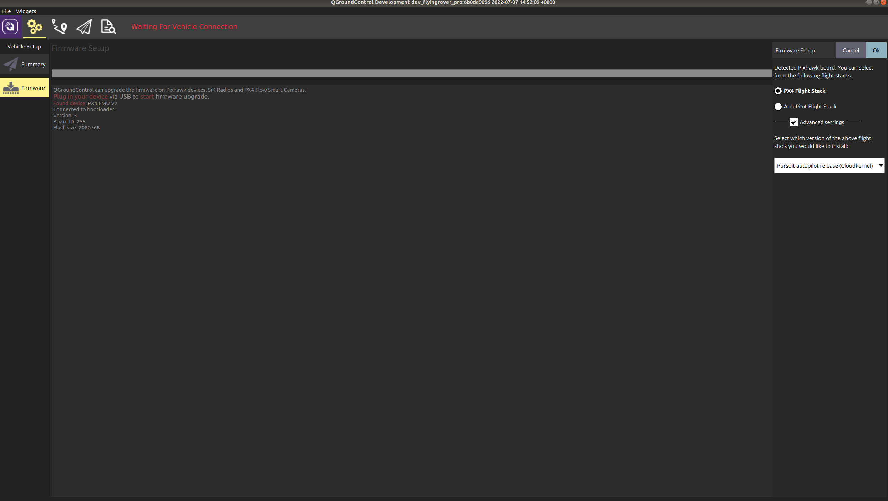

.. _tutorial_firmware_upgrade:

Upgrade Autopilot Firmware Remotely
=======================================================

The firmware of the Pursuit autopilot can be upgraded to ensure the software stability and obtain the latest improvements.

- Start our customized QGroundcontrol software in Ubuntu 18.04 or Windows 11, refer to :ref:`section_quickstart` for downloads and installation.

- Select the Firmware tab under the Setting menu. Disconnect the DC power for the autopilot and connect the debug port to the computer via the provided Micro USB cable. Click the Advanced settings at the right side, and select the option "Pursuit autopilot release (Cloudkernel)". Then the automatic upgrade process can be triggered by clicking the "OK" button in the upper right corner.

