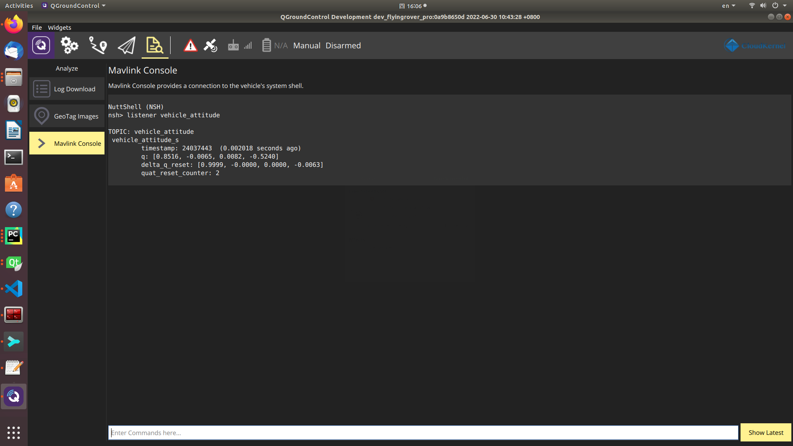
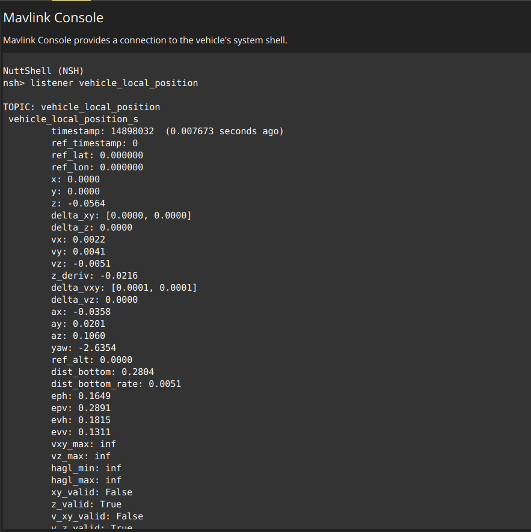

.. _tutorial_qgc_console:

Console Interface in Ground Control Station
================================================

We provide convenience commands in the console interface of QGroundcontrol software. These commands can help users to monitor
system status and locate malfunctions in hardware and software layers.

Sensor Layer Status
-------------------------

The Pursuit autopilot consists of multiple sensors for comprehensive sensor fusion, including accelerometer, gyroscope, barometer and magnetometer.
The sensor data is critical to system operation, but these sensors are not error-proof as they can be degraded by long-term vibration, over-heat and humidity.
Therefore, it's always advisable for users to check sensor data first when the system doesn't work as expected.

To view the sensor data in the autopilot, simple enter commands in the Mavlink Console:

::

        listener sensor_accel  # display accelerometer data
        listener sensor_gyro   # display gyroscope data
        listener sensor_baro   # display barometer data
        listener sensor_mag    # display magnetometer data

A sensor is problematic when there is no output from the corresponding command.

AGV Chassis Layer
-----------------------

The VCU unit of the AGV chassis is connected to the autopilot via a CAN bus.

To view the VCU status, simply try:

::

        vcu_bridge status           # display the driver status for VCU communication

        listener vcu_base_status    # display the vcu base status
        listener vcu_control_cmd    # display the command sent to the vcu base

Users can also test the AGV chassis with simple maneuvers by:

        vcu_bridge test

RTK Layer Status
--------------------

The RTK gps is connected to the autopilot via a serial port, and the gps data can be viewed by:

::

        gps status                      # display the gps driver status
        listener vehicle_gps_position   #display gps data published to the sensor fusion module

Vehicle State
---------------------

The vehicle state (attitude, position and velocity) can be viewed by:

::

        listener vehicle_attitude           # display vehicle attitude from the sensor fusion module
        listener vehicle_local_position     # display vehicle position and velocity from the sensor fusion module

.. caution::

    📌 The fields xy_valid, z_valid and v_xy_valid indicate the localization status, and the vehicle can be operated only when all these fields are true. In the case of RTK outdoor localization, the typical value of eph and epv should be less than 1.0 to ensure positioning accuracy.

High-Level Algorithm Status
--------------------------------

In the case of RTK navigation solution with obstacle avoidance functionality, the command below can show the obstacle status, laser data and planner output validity.

::

        listener avoidance_status

The definition of avoidance_status topic is listed below.

::

        bool  flag_obstacle_in_far_front   # Obstacle is in far front of the vehicle
        bool  flag_obstacle_far_nearby  # Obstacle is in the neighbourhood of the vehicle with a large distance
        bool  flag_obstacle_in_front       # Obstacle is at the front of the vehicle
        bool  flag_obstacle_in_rear        # Obstacle is at the back of the vehicle
        bool  flag_obstacle_nearby         # Obstacle is within a distance from the vehicle
        bool  flag_nav_task_active         # True when navigation task is active onboard
        bool  flag_nav_local_plan_valid    # The local plan from navigation is valid for obstacle avoidance
        bool  flag_laser_scan_data_valid   # Laser scan data is valid for obstacle detection

.. caution::

        The field flag_laser_scan_data_valid is true when the laser scanner data is valid in the companion computer.
