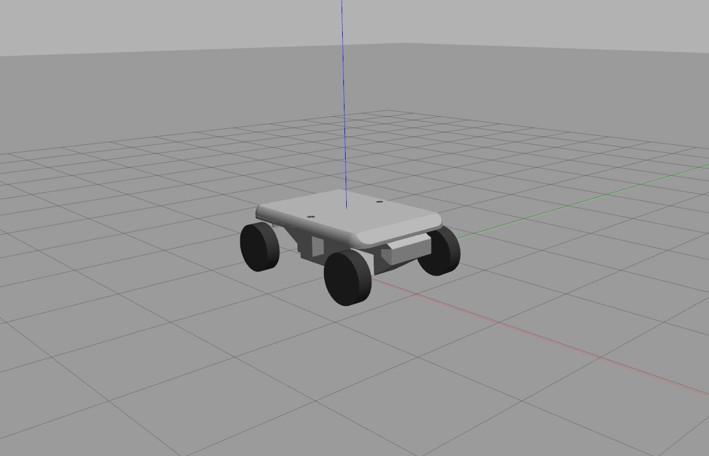
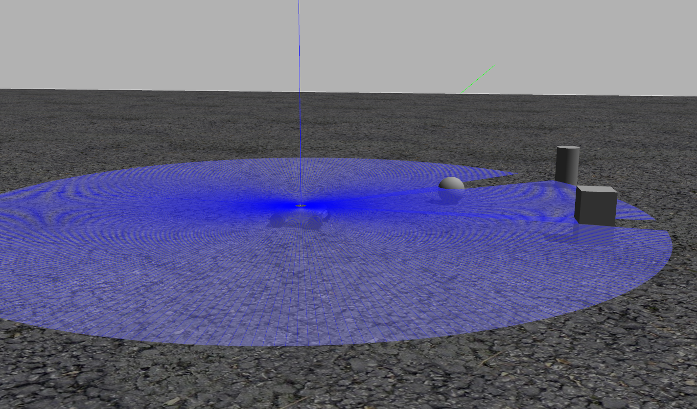

.. _tutorial_sitl_sim:

Simulation Environment for Software Validation
=================================================

We devise simulation environment for various scenarios with Pursuit autopilot, so that users can validate their software directly
in simulation without field test. The environment is based on the Gazebo engine.

.. Hint::

    The software package is delivered with proprietary thumbdrives on additional payment, please consult our sales on how to purchase.

1. Workspace Directory
----------------------------

The workspace for the simulation environment is located in ~/pursuit_space/sitl_space_pursuit in the provided thumbdrive. Users
can easily boot their computers from the thumbdrive following the user manual.

.. raw:: html

    
 (a) Simulation for a ground vehicle in empty environment
    

     

.. raw:: html

    
 (b) Simulation for a ground vehicle in cluttered environment
    

     

2. How to Use
------------------

We support several simulation cases as below.

Case 1: Empty environment with GPS navigation
^^^^^^^^^^^^^^^^^^^^^^^^^^^^^^^^^^^^^^^^^^^^^^^^

This is the simplest simulation case that can be brought up by:

::

        bash sitl_run.sh $PWD/bin/px4 none gazebo pursuit_base

Users can then operate the ground vehicle in QGroundcontrol software.

Case 2: Offboard control with GPS navigation
^^^^^^^^^^^^^^^^^^^^^^^^^^^^^^^^^^^^^^^^^^^^^^^^^^^^^^^^^^^

For users to develop offboard control applications, the simulation can also be brought up with all necessary nodes including mavros as below. Note that
the catkinws_nav workspace must be in the same directory (~/pursuit_space) so that the setup_pursuit.bash script can source the correct mavros package.

::

        source setup_pursuit.bash
        roslaunch launch/mavros_posix_sitl_pursuit_base.launch

Case 3: Offboard control in outdoor cluttered environment with 2D lidar
^^^^^^^^^^^^^^^^^^^^^^^^^^^^^^^^^^^^^^^^^^^^^^^^^^^^^^^^^^^^^^^^^^^^^^^^^^^^^^^^^^^

We also support the simulation of ground vehicles equipped with 2D lidar, which is the main feature for our model A+. The launch file below
can activate 2D lidar and its corresponding ROS topics. Users have to set GND_RMC_OBS_EN as 0 manually in QGroundcontrol to enable offboard control.

::

        source setup_pursuit.bash
        roslaunch launch/mavros_posix_sitl_pursuit_base_rplidar.launch

