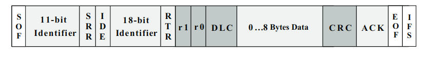

.. _tutorial_open_can_protocol_zh:

用于AGV底盘集成的开放式CAN协议
================================================

由于用户对定制 AGV 底盘集成的需求不断增加，我们决定开放Pursuit自动驾驶仪使用的 CAN 协议。CAN 接口在自动驾驶仪和 AGV 底盘之间提供可靠的通信，它还允许进一步扩展到其他
外设。

协议配置
-------------------------
Pursuit 自动驾驶仪支持 CAN 2.0B（扩展格式）协议，该协议明细可参考 https://www.ti.com/lit/an/sloa101b/sloa101b.pdf 。

我们CAN协议的详细配置参数如下：

- Baud rate: 500K
- Time Segment 1 (TSEQ1): 8
- Time Segment 2 (TSEQ2): 3
- Synchronization Jump Width (SJW): 2

阿卡曼底盘协议
----------------------------------

#. **Steering Control Command （转向控制消息）**

    .. image:: ../img/can_protocol/ackermann_ctrl_cmd_msg_zh.png
       :width: 750 px
       :height: 700 px
       :scale: 100 %
       :align: center

#. **Control Feedback Command （控制反馈消息）**

这个指令与 Steering Control Command 一同使用，由底盘发往自驾仪。

    .. image:: ../img/can_protocol/ackermann_ctrl_fb_msg_zh.png
       :width: 750 px
       :height: 700 px
       :scale: 100 %
       :align: center

四转四驱底盘协议
---------------------------------

4WS-4WD四转四驱（四轮转向和四轮驱动）底盘在狭窄空间内具有先进的机动性。

#. **4WS-4WD Control Command（四转四驱控制消息）**

    .. image:: ../img/can_protocol/4w4d_ctrl_cmd_msg_zh.png
       :width: 750 px
       :height: 700 px
       :scale: 100 %
       :align: center

#. **4WS-4WD Control Feedback Command（四转四驱控制反馈消息）**

这个指令与 4WS-4WD Control Command一同使用，由底盘发往自驾仪。

    .. image:: ../img/can_protocol/4w4d_ctrl_fb_msg_zh.png
       :width: 750 px
       :height: 700 px
       :scale: 100 %
       :align: center
