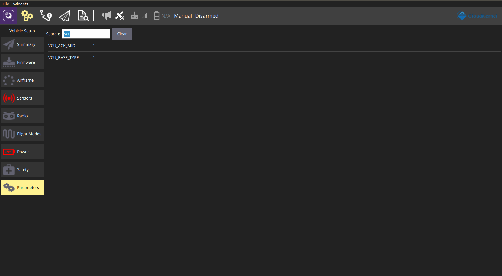

.. _tutorial_periph_config_zh:

外围设备配置
==============================

外设配置可以通过 QGroundcontrol 软件中的参数设置界面轻松完成，如下所示。默认情况下，我们提供的产品在工厂为客户选择的外围设备进行了适当的配置。这里的文档
为用户侧的适配或变动提供参考。

无人车底盘
---------------

**煜禾森机器人**
^^^^^^^^^^^^^^^^^^^^

- MK ROBOT-01 阿卡曼车型

        .. image:: ../img/periph_config/mkrobot-1.png
           :height: 450 px
           :width: 750 px
           :scale: 50 %
           :align: center

        相关参数设置为：

        ::

                VCU_BASE_TYPE = 1  # enable the ackermann vehicle type
                VCU_ACK_MID = 1   # model id for MK robot -01

- FW-MAX 四转四驱车型

        .. image:: ../img/periph_config/fwmax.png
           :height: 450 px
           :width: 750 px
           :scale: 50 %
           :align: center

        相关参数设置为：

        ::

                VCU_BASE_TYPE = 2  # enable the 4 wheels differential drive vehicle type
                VCU_DD4_MID = 1    # model id for FW-max

RTK设备
------------

**QF RTK**
^^^^^^^^^^^^

- R3C 流动RTK

        .. image:: ../img/periph_config/qf_r3c.png
           :height: 550 px
           :width: 700 px
           :scale: 40 %
           :align: center

        相关参数设置为：

        ::

                SER_GPS1_BAUD = 115200  # baud rate for RTK serial communication
                GPS_RTK_ID = 1          # model id

**Comnav Technology**
^^^^^^^^^^^^^^^^^^^^^^^^^^

- M100 RTK

        .. image:: ../img/periph_config/M100.png
           :height: 550 px
           :width: 700 px
           :scale: 40 %
           :align: center

        使能M100 RTK（设置为comnav二进制协议）的参数为：

        ::

                SER_GPS1_BAUD = 115200  # baud rate for RTK serial communication
                GPS_RTK_ID = 2          # model id
