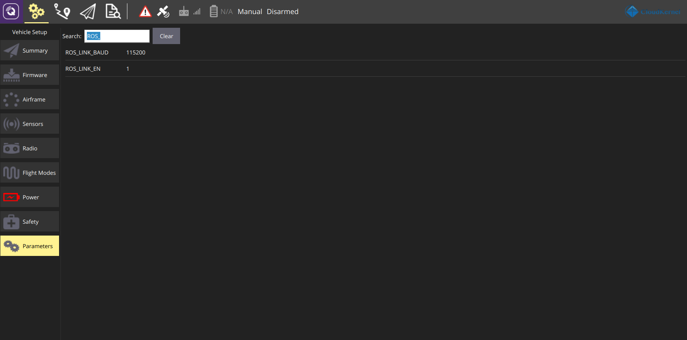
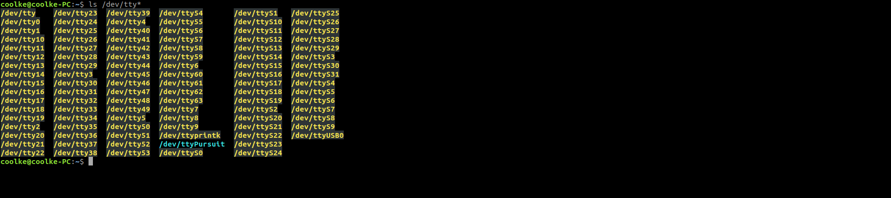
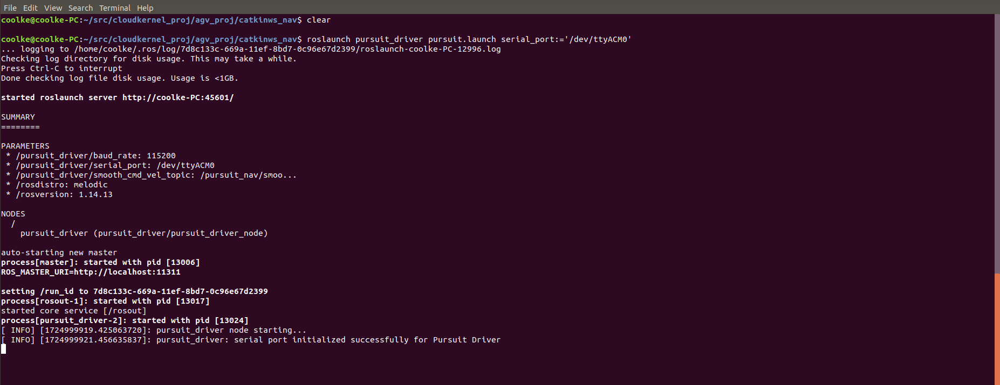
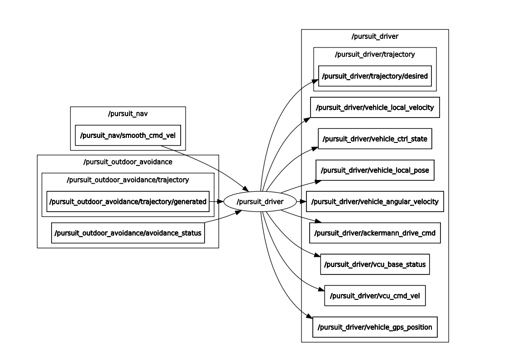
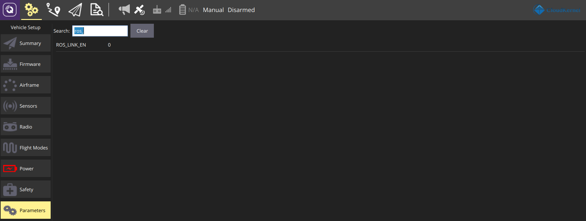
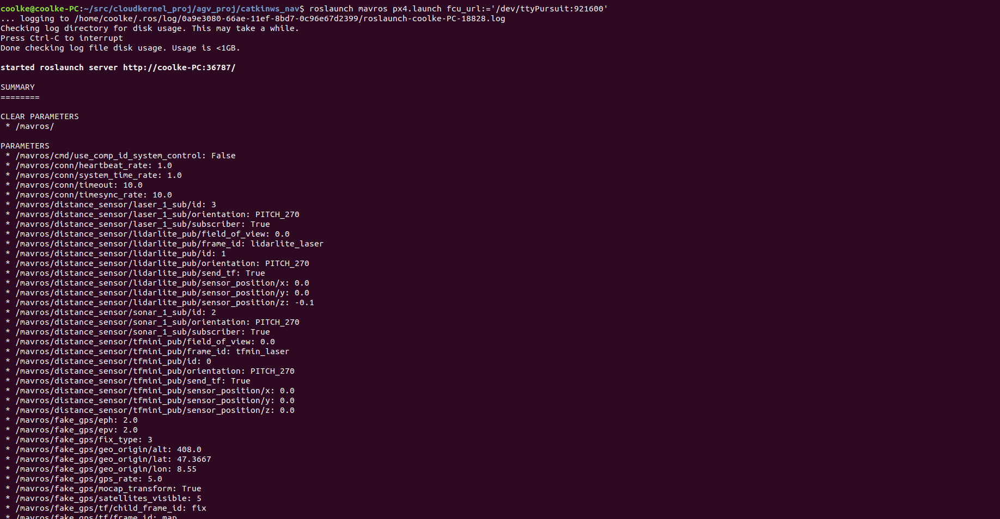
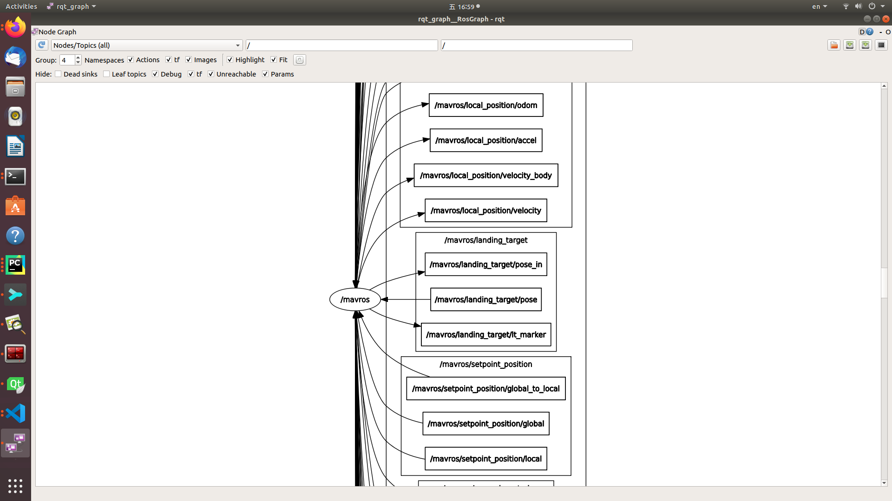

.. _tutorial_ros_driver_zh:

使用 ROS 驱动程序访问自驾仪
=================================

我们提供了两个 ROS 软件包来与 Pursuit 自动驾驶仪连接，如 API 部分所述。它们适用于不同的使用案例。`pursuit_driver <https://gitee.com/cloudkernel-tech/pursuit_driver>`_
主要面向没有编程基础的终端用户，而 `mavros <https://gitee.com/cloudkernel-tech/mavros>`_ 包面向高级开发者设计，并支持物联网通信和机器人模拟等扩展功能。
模拟。

方式一： 使用pursuit_driver包
--------------------------------

通过在 QGroundcontrol 软件中设置参数来启用与 pursuit_driver 包的接口，如下所示：

::

        ROS_LINK_BAUD=115200   #baud rate
        ROS_LINK_EN=1          #enable the pursuit_driver interface

要在 ROS 中启动 pursuit_driver，用户必须首先使用命令找到自动驾驶仪的 USB 端口。在我们官方提供的 docker 容器中，默认的 USB port 为 /dev/ttyPursuit。

::

        ls /dev/tty*

然后可以通过以下方式启动pursuit_driver节点：

::

        cd ~/src/catkinws_nav
        source devel/setup.bash

        # launch with default port /dev/ttyPursuit
        roslaunch pursuit_driver pursuit.launch

        # or with the specified USB port, e.g. /dev/ttyUSB0
        roslaunch pursuit_driver pursuit.launch serial_port:='/dev/ttyUSB0'

pursuit_driver 节点的 rqt 图如下所示：

方式二：使用mavros包
------------------------

通过将参数设置为以下内容来启用与 mavros 包的接口：

::

        ROS_LINK_EN=0           # enable the mavros interface

        SER_TEL2_BAUD = 921600  # the default baud rate for mavros interface, which is visible only after setting ROS_LINK_EN=0

用户必须以与pursuit_driver相同的方式找到自动驾驶仪的 USB 端口，然后使用以下命令启动节点：

::

        cd ~/src/catkinws_nav
        source devel/setup.bash

        # launch for default port with 921600 baud rate
        roslaunch mavros px4.launch fcu_url:='/dev/ttyPursuit:921600'

mavros节点的局部rqt graph视图是：

